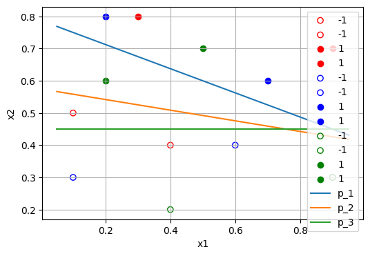

# 概要

[Learning Lukasiewicz Logic Fragments by Quadratic Programming](http://ecmlpkdd2017.ijs.si/papers/paperID223.pdf) のアルゴリズムの実装です．


## 環境構築

```{shell}
$ python3 -m venv myenv
$ source myenv/bin/activate
$ pip install -r requirements.txt
```

## ディレクトリ

---
もう少し詳しく

---


- inputs/ ... 入力データ
  - toy_data/ ... Toy problem の入力データ
  - winston_data/ ... Winston benchmark の入力データ
- notebooks/ ... 実験用 Jupyter Notebook
- src/ ... ソースコード

  
## 実験コードの実行手順

1. ライブラリのインポート

```
import cvxpy as cp

from src.setup_problem import Setup
```

2. 入力データの準備

```
# 例
data_dir_path = "./inputs/toy_data"

# 例
file_names_dict = {
    "supervised": ["L_p1(x)", "L_p2(x)", "L_p3(x)"],
    "unsupervise": ["U"]
    "rule": ["rules"]
}
```

3. 目的関数，制約の構成

```
problem_instance = Setup(data_dir_path, file_names_dict)

# 例
objective, constraints = problem_instance.main(c1=10, c2=10)
```

4. 最適化の実行

```
problem = cp.Problem(objective, constraints)
result = problem.solve(verbose=True)
```

5. 評価

---

hogehogehogehogehogehogehogehoge

---

6. 可視化（データの次元が 2 の時のみ）

```
from src.misc import visualize_result

visualize_result(problem_instance)
```




